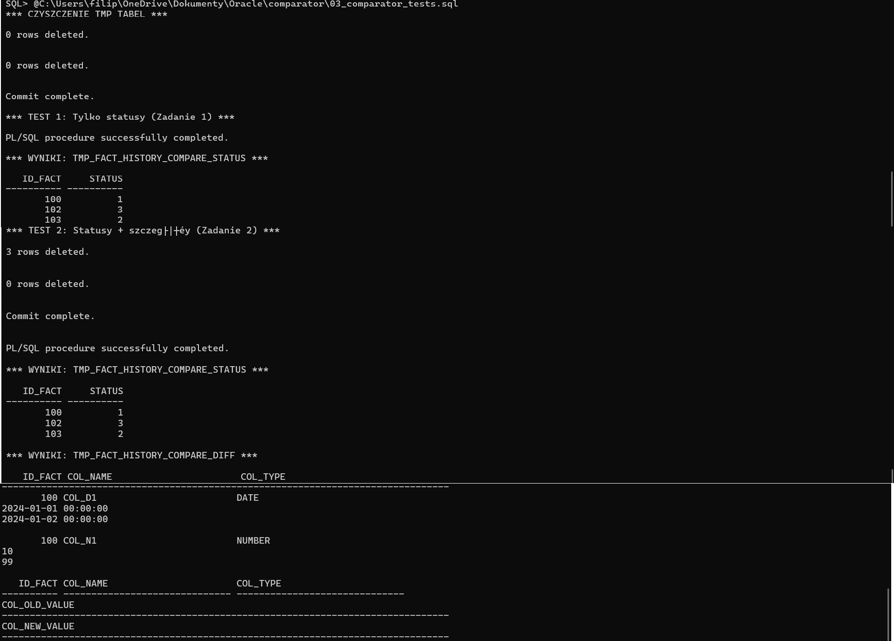
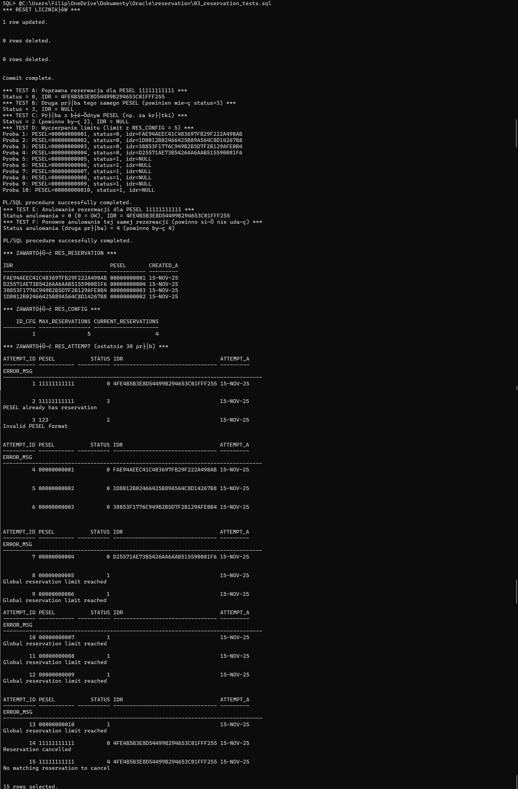

# Zadania rekrutacyjne – Junior Data Engineer (DataFuze)

Autor: **Filip Galiński**  
Baza: **Oracle Database 21c XE** (XEPDB1)  
Narzędzie: **SQL*Plus** / **SQL Developer**

Repozytorium zawiera rozwiązania wszystkich 5 zadań rekrutacyjnych:

- **Zadania 1–2** – projekt **COMPARATOR**  
- **Zadanie 3 (+ część „dla chętnych”)** – projekt **RESERVATION**  
- **Zadania 4–5** – projekt **REPORTS**

WYMAGANIA STRUKTURA PROJEKTU INSTRUKCJA STARTU

---


## 1-2. COMPARATOR (Zadania 1–2)

### Cel

Porównanie dwóch „paczek” danych faktów (stara vs nowa) na podstawie identyfikatora paczki:

- **Zadanie 1** – ustalenie statusu rekordu (MODIFIED / NEW / DELETED)  
- **Zadanie 2** – dodatkowo lista różnic na poziomie kolumn zapisanych w tabeli z „diffem”.

### Tabele

Tworzone w `01_comparator_setup_local.sql`:

- `fact_history`  
  - `id_pack` – identyfikator paczki (np. 1=stara, 2=nowa)  
  - `id_fact` – identyfikator rekordu  
  - `col_d1` (DATE), `col_n1` (NUMBER), `col_c1` (VARCHAR2)

- `tmp_fact_history_compare_status`  
  - `id_fact`  
  - `status`:
    - `1` – MODIFIED (rekord w obu paczkach, różnice w danych)  
    - `2` – NEW (rekord tylko w nowej paczce)  
    - `3` – DELETED (rekord tylko w starej paczce)

- `tmp_fact_history_compare_diff`  
  - `id_fact`  
  - `col_name` – nazwa kolumny, która się różni  
  - `col_type` – typ kolumny (DATE / NUMBER / VARCHAR2)  
  - `col_old_value` / `col_new_value` – wartości ze starej i nowej paczki (jako tekst)

Skrypt setupu wstawia dane testowe, m.in.:

- ID 100 – rekord istnieje w obu paczkach, ale z innymi wartościami (status MODIFIED)
- ID 101 – rekord taki sam w obu paczkach (powinien nie pojawić się w wynikach)
- ID 102 – tylko w starej paczce (DELETED)
- ID 103 – tylko w nowej paczce (NEW)

### Pakiet `COMPARATOR_PKG`

Plik: `02_comparator_pkg.sql`

Specyfikacja:

- `PROCEDURE compare_fact(id_pack_old IN NUMBER, id_pack_new IN NUMBER);``  
  - Zadanie 1 – uzupełnia tylko tabelę `tmp_fact_history_compare_status`.

- `PROCEDURE compare_fact(id_pack_old IN NUMBER, id_pack_new IN NUMBER, build_diff IN BOOLEAN DEFAULT FALSE);`  
  - Zadanie 2 – jeśli `build_diff = TRUE`, uzupełnia też `tmp_fact_history_compare_diff` szczegółami różnic.

W implementacji:

- porównanie odbywa się po `id_fact`,
- jeśli rekord jest w obu paczkach – porównywane są wszystkie trzy kolumny `col_d1 / col_n1 / col_c1`,
- wartości numeryczne i daty są zamieniane na tekst (`TO_CHAR`) z ustalonym formatem daty.

Pakiet **nie commituje** – commit jest w skryptach testowych.

### Testy

Plik: `03_comparator_tests.sql`

- czyści tabele tymczasowe,
- uruchamia:

  - test statusów (Zad. 1),
  - test statusów + diff (Zad. 2),

- na końcu wypisuje zawartość:
  - `tmp_fact_history_compare_status` – widać ID 100/102/103 ze statusami 1/3/2,  
  - `tmp_fact_history_compare_diff` – widać zmienione kolumny dla ID 100.

---

## 3. RESERVATION (Zadanie 3 + anulowanie „dla chętnych”)

### Cel

Symulacja systemu rezerwacji biletów na wydarzenie:

- jeden globalny limit rezerwacji,
- maksymalnie jedna rezerwacja na PESEL,
- obsługa wielu równoległych sesji,
- wymóg logowania każdej próby (udanej i nieudanej) w dedykowanej tabeli,
- dodatkowo: procedura anulowania rezerwacji (część „dla chętnych”).

### Tabele i sekwencja

Tworzone w `01_reservation_setup_local.sql`:

- `res_config`  
  - `id_cfg` – identyfikator konfiguracji (używam `1`)  
  - `max_reservations` – maksymalna liczba rezerwacji (w skrypcie testowym = 5; w realnym systemie np. 50000)  
  - `current_reservations` – bieżąca liczba rezerwacji

- `res_reservation`  
  - `idr` – unikalny identyfikator rezerwacji (`RAWTOHEX(SYS_GUID())`)  
  - `pesel` – PESEL klienta (unikatowy)  
  - `created_at` – data utworzenia

- `res_attempt`  
  - `attempt_id` – klucz główny (sekwencja `res_attempt_seq`)  
  - `pesel` – PESEL użyty w próbie (także jeśli błędny)  
  - `status` – kod statusu zwrócony przez procedurę  
  - `idr` – ID rezerwacji (jeśli dotyczy)  
  - `attempt_at` – data próby  
  - `error_msg` – opis błędu / informacja diagnostyczna

### Pakiet `RESERVATION_PKG`

Plik: `02_reservation_pkg.sql`

#### Stałe statusów

W pakiecie zdefiniowane są stałe:

- `c_status_ok             = 0`
- `c_status_limit          = 1`
- `c_status_bad_pesel      = 2`
- `c_status_already_exists = 3`
- `c_status_not_found      = 4`
- `c_status_error          = 9`

Używane przez obie procedury.

#### Procedura rezerwacji: `reserve_ticket`

Specyfikacja:

```plsql
PROCEDURE reserve_ticket (
    p_pesel   IN  VARCHAR2,
    p_status  OUT NUMBER,
    p_idr     OUT VARCHAR2
);
```

Zachowanie:

1. Walidacja PESEL – prosty check: 11 cyfr (`REGEXP_LIKE`).  
   - w razie błędu: `status = 2`, log w `res_attempt`, brak rezerwacji.

2. Pobranie konfiguracji z `res_config` (wiersz `id_cfg = 1`) z `SELECT ... FOR UPDATE`.  
   - jeśli nie ma wiersza – `status = 9`, log i return.

3. Sprawdzenie limitu: jeśli `current_reservations >= max_reservations` → `status = 1`, log i return.

4. Próba wstawienia nowej rezerwacji:
   - generowany jest `p_idr` przez `RAWTOHEX(SYS_GUID())`,
   - `INSERT INTO res_reservation(idr, pesel)`,
   - `UPDATE res_config` (`current_reservations = current_reservations + 1`).

5. Obsługa wyjątków:
   - `DUP_VAL_ON_INDEX` (PESEL już ma rezerwację) → `status = 3`, log  
   - inne błędy → `status = 9`, log z `SQLERRM`, re-raise.

Każda próba (niezależnie od statusu) jest logowana przez pomocniczą procedurę `log_attempt` działającą w autonomicznej transakcji (`PRAGMA AUTONOMOUS_TRANSACTION`).

#### Procedura anulowania: `cancel_ticket` (dla chętnych)

Specyfikacja:

```plsql
PROCEDURE cancel_ticket (
    p_pesel   IN  VARCHAR2,
    p_idr     IN  VARCHAR2,
    p_status  OUT NUMBER
);
```

Zachowanie:

1. Walidacja PESEL (tak samo jak w rezerwacji).  
2. Pobranie konfiguracji (`res_config` dla `id_cfg = 1` z `FOR UPDATE`).  
3. Próba znalezienia rezerwacji (`SELECT ... FOR UPDATE` z `res_reservation` po `pesel + idr`).  
   - jeśli brak – `status = 4`, log z komunikatem „No matching reservation to cancel”.
4. Jeśli rezerwacja istnieje:
   - `DELETE FROM res_reservation` po `pesel + idr`,
   - dekrementacja `current_reservations` (ale nie schodzi poniżej 0),
   - `status = 0`, log z komunikatem „Reservation cancelled”.

Ponownie, każda próba anulowania jest logowana w `res_attempt`.

### Testy

Plik: `03_reservation_tests.sql`

Scenariusze:

- **Test A** – poprawna rezerwacja dla PESEL `11111111111`  
  → `status = 0`, `idr` ustawiony

- **Test B** – druga próba tego samego PESEL  
  → `status = 3`, `idr = NULL`

- **Test C** – błędny PESEL (za krótki)  
  → `status = 2`, `idr = NULL`

- **Test D** – symulacja wyczerpania limitu z konfiguracji (5 miejsc)  
  → pierwsze 4 różne PESELe: `status = 0`  
  → kolejne próby: `status = 1` („limit reached”)

- **Test E** – anulowanie rezerwacji dla `11111111111`  
  → `status = 0`, licznik rezerwacji w `res_config` zmniejszony

- **Test F** – ponowne anulowanie tej samej rezerwacji  
  → `status = 4`, brak zmian w liczniku

Na końcu skryptu:

- `SELECT` z `res_reservation` – aktywne rezerwacje,  
- `SELECT` z `res_config` – wartość limitu i aktualny licznik,  
- `SELECT` z `res_attempt` – wszystkie próby z kodami statusów i opisami.

---

## 4/5. REPORTS (Zadania 4–5)

### Setup danych

Plik: `reports/01_reports_setup_local.sql`

Tworzy trzy proste tabele:

- `regiony (id, nazwa)`  
- `pracownicy (id, imie, nazwisko, reg_id)`  
- `sprzedaz (id, dt, prac_id, wartosc)`

Dane testowe obejmują:

- transakcje w roku 2023 (poza zakresem 12 miesięcy, żeby pokazać działanie filtra),
- transakcje w lutym 2024 (ważne dla Zadania 5),
- kilka transakcji w innych miesiącach 2024 i 2025 (dla Zadania 4).

### Zadanie 4 – raport miesięczny za 12 miesięcy wstecz

Plik: `reports/02_zad4_miesieczny_raport.sql`  
Tworzy widok:

```sql
CREATE OR REPLACE VIEW v_raport_miesieczny_sprzedaz AS
...
```

Logika:

- CTE `months` generuje 12 miesięcy wstecz względem `SYSDATE`, bez miesiąca bieżącego, np. dla listopada 2025: od 2024-11 do 2025-10.
- `CROSS JOIN pracownicy` → każdy pracownik pojawia się w każdym z 12 miesięcy.
- `LEFT JOIN sprzedaz` po pracowniku i miesiącu.
- Agregaty per `(pracownik, miesiąc)`:
  - `liczba_transakcji`,
  - `wartosc_miesieczna`,
  - `srednia_wartosc_transakcji`,
  - `max_wartosc_transakcji`.

Przy braku sprzedaży w danym miesiącu dla danego pracownika wszystkie wartości są równe 0.

Przykład użycia:

```sql
SELECT *
FROM v_raport_miesieczny_sprzedaz
ORDER BY rok_miesiac, pracownik_id;
```

### Zadanie 5 – najlepsi sprzedawcy w lutym 2024

Plik: `reports/03_zad5_najlepsi_luty2024.sql`  
Tworzy widok:

```sql
CREATE OR REPLACE VIEW v_najlepsi_sprzedawcy_luty2024 AS
...
```

Logika:

1. CTE `sales_agg`:
   - filtruje sprzedaż do lutego 2024 (`dt >= 2024-02-01 AND dt < 2024-03-01`),
   - agreguje `SUM(wartosc)` według `(region, pracownik)`.

2. CTE `ranked`:
   - dodaje `ROW_NUMBER() OVER (PARTITION BY reg_id ORDER BY suma_sprzedazy DESC)`.

3. Widok wybiera tylko wiersze z `rn = 1` – najlepsi sprzedawcy w każdym regionie.

Przykład użycia:

```sql
SELECT *
FROM v_najlepsi_sprzedawcy_luty2024
ORDER BY reg_id, pracownik_id;
```

Dla przygotowanych danych:

- w każdym regionie wybrany jest pracownik z najwyższą sumą sprzedaży w lutym 2024,
- regiony bez sprzedaży w tym okresie nie pojawiają się w wyniku.

---

## Podsumowanie

- Każde zadanie (4 oraz 5 indywidualnie) ma:
  - osobny skrypt setupu (tabele + dane),
  - skrypt z logiką (pakiet / widoki),
  - skrypt testowy z przykładami użycia.
- Logiki dla zadań 1–3 są zaimplementowane w PL/SQL (`COMPARATOR_PKG`, `RESERVATION_PKG`),  
  zadania 4–5 w postaci widoków SQL (`v_raport_miesieczny_sprzedaz`, `v_najlepsi_sprzedawcy_luty2024`).
- Skrypty testowe dokumentują scenariusze z treści zadań (np. „druga próba tego samego PESEL”, „wyczerpanie limitu”, „statusy 1/2/3 w porównaniu paczek”).

W obecnej formie całość jest gotowa do uruchomienia i weryfikacji.

## Screenshots

### COMPARATOR – testy (Zadania 1–2)



### RESERVATION – testy (Zadanie 3)



### REPORTS – Zadanie 4


### REPORTS – Zadanie 5


---

## Wymagania wstępne

- Oracle Database XE 21c (testowane na XEPDB1)  
- Użytkownik z uprawnieniami do:
  - tworzenia tabel, sekwencji, widoków,
  - uruchamiania PL/SQL (pakiety, procedury).  
- Możliwość połączenia jako użytkownik **SYSTEM** (tak robiłem na lokalnej instancji).

We wszystkich przykładach używam:

```sql
CONNECT system/<haslo>
ALTER SESSION SET CONTAINER = XEPDB1;
```

Ścieżki do plików możena dostosować do własnej lokalizacji.

---

## Struktura katalogów i plików

```
comparator/
  01_comparator_setup_local.sql     -- utworzenie tabel + danych testowych
  02_comparator_pkg.sql             -- rozwiązanie zad. 1 oraz 2
  03_comparator_tests.sql           -- testy

reservation/
  01_reservation_setup_local.sql    -- utworzenie tabel + danych testowych
  02_reservation_pkg.sql            -- rozwiązanie zad. 3
  03_reservation_tests.sql          -- testy

reports/
  01_reports_setup_local.sql        -- utworzenie tabel + danych testowych
  02_zad4_miesieczny_raport.sql     -- zadanie 4
  03_zad5_najlepsi_luty2024.sql     -- zadanie 5
```

---

## Jak uruchomić cały zestaw zadań

Przykład dla SQL*Plus:

```sql
CONNECT system/<haslo>
ALTER SESSION SET CONTAINER = XEPDB1;

-- Zadania 1–2 (COMPARATOR)
@<sciezka>/comparator/01_comparator_setup_local.sql
@<sciezka>/comparator/02_comparator_pkg.sql
@<sciezka>/comparator/03_comparator_tests.sql

-- Zadanie 3 (RESERVATION)
@<sciezka>/reservation/01_reservation_setup_local.sql
@<sciezka>/reservation/02_reservation_pkg.sql
@<sciezka>/reservation/03_reservation_tests.sql

-- Zadania 4–5 (REPORTS)
@<sciezka>/reports/01_reports_setup_local.sql
@<sciezka>/reports/02_zad4_miesieczny_raport.sql
@<sciezka>/reports/03_zad5_najlepsi_luty2024.sql
```

---


